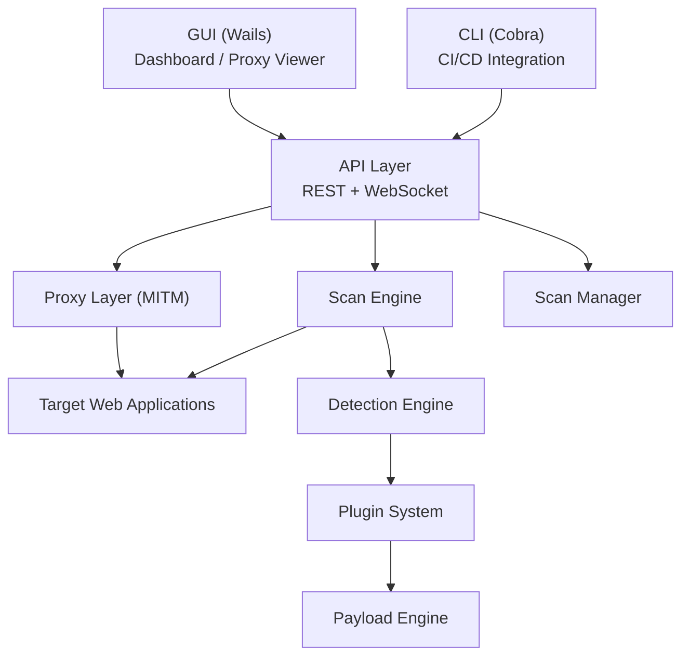
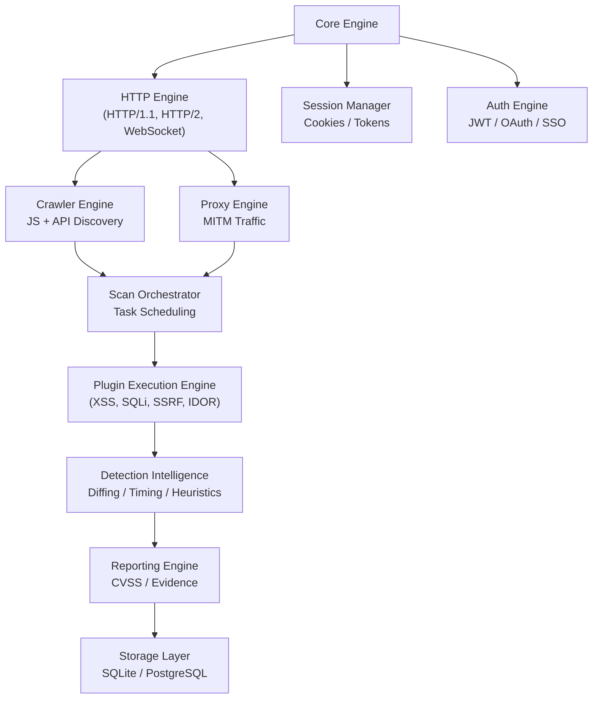
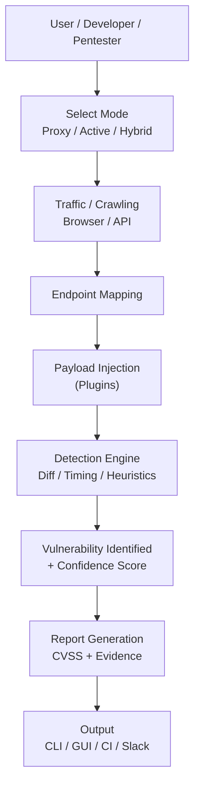
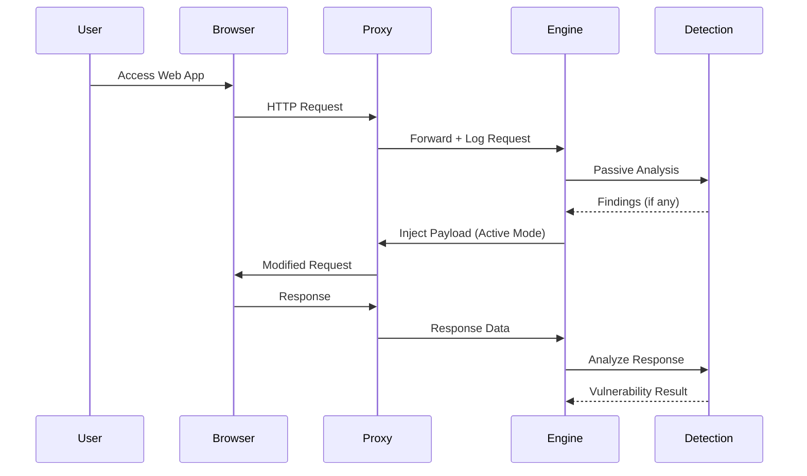
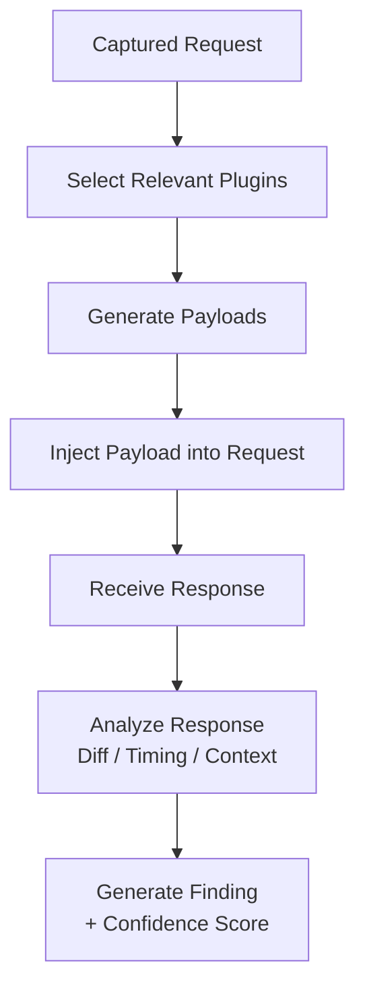
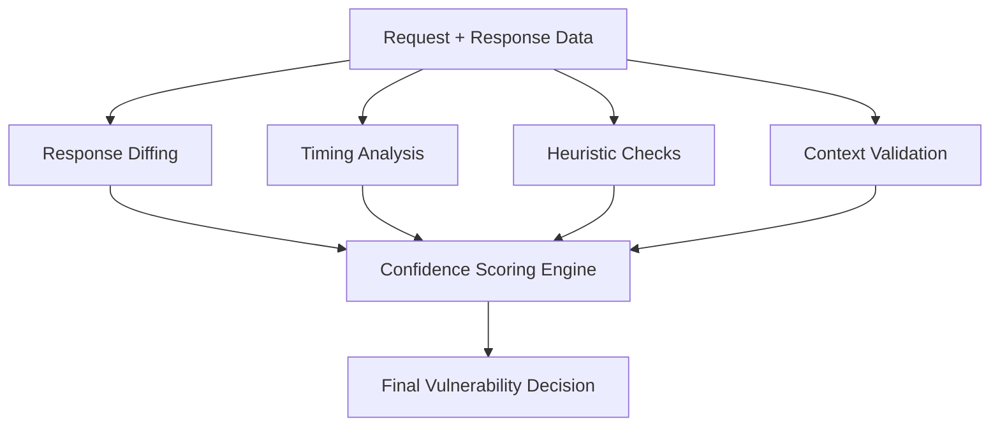

## 1. SYSTEM ARCHITECTURE (High-Level)

## 2. DETAILED ARCHITECTURE (Internal Components)

## 3. WORKFLOW DIAGRAM (End-to-End)

## 4. REAL-TIME PROXY FLOW (Your Key Differentiator)

## 5. PLUGIN EXECUTION FLOW

## 6. DETECTION ENGINE LOGIC FLOW

