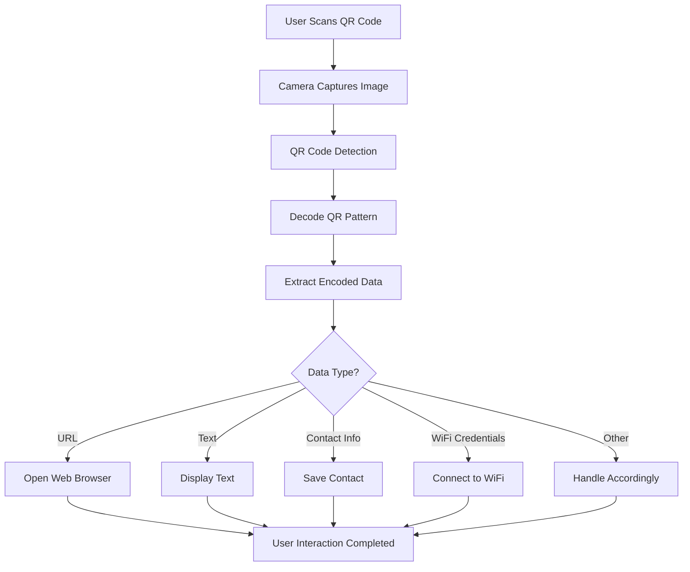

```mermaid
flowchart TD
    A[User Scans QR Code] --> B[Camera Captures Image]
    B --> C[QR Code Detection]
    C --> D[Decode QR Pattern]
    D --> E[Extract Encoded Data]
    E --> F{Data Type?}

    F -->|URL| G[Open Web Browser]
    F -->|Text| H[Display Text]
    F -->|Contact Info| I[Save Contact]
    F -->|WiFi Credentials| J[Connect to WiFi]
    F -->|Other| K[Handle Accordingly]

    G --> L[Access Website]
    H --> L
    I --> L
    J --> L
    K --> L

    L[User Interaction Completed]
```
